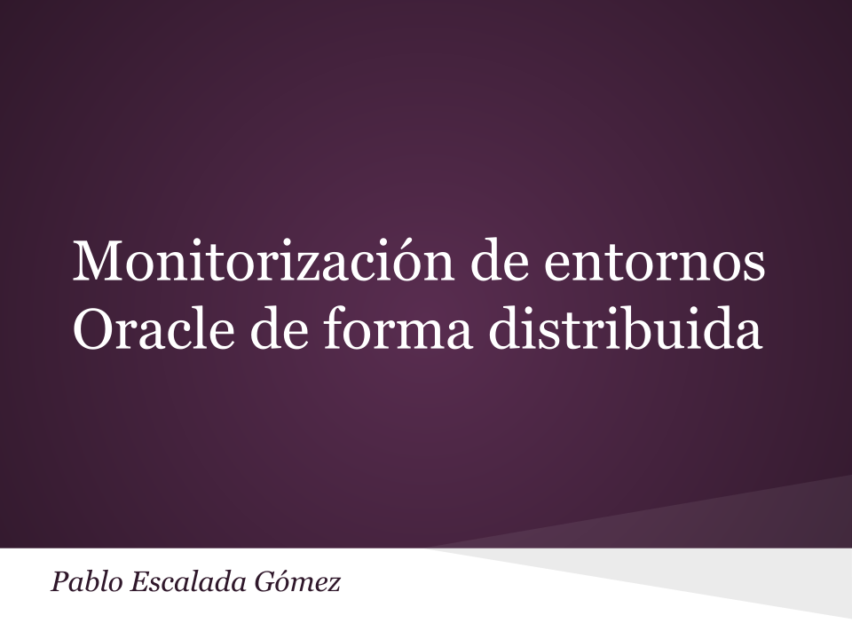

> Proyecto Fin de Máster en Ingeniería Web de la Universidad de Oviedo
>
> Originalmente publicado en http://hdl.handle.net/10651/31965

[MonitORA](https://github.com/diesire/monitora) es un aplicación para la monitorización de bases de datos Oracle de manera distribuida. Ofrece una alternativa sencilla, multiplataforma, modular, escalable y de bajo coste a otras herramientas del mercado.

Consta de dos componentes:

*   El **agente**, que se instala en el servidor de Base de Datos del cliente, es un servicio que recoge información del sistema mediante consultas SQL o comandos del Sistema Operativo que se ejecutan de acuerdo a una planificación configurable y los almacena temporalmente en una Base de Datos local. Posteriormente los envía al servidor para su procesamiento.
*   El **servidor** central es el encargado de controlar todos los agentes remotos. Permite configurar las tareas que realiza cada agente y su planificación, y almacena en una Base de Datos centralizada la información recuperada de los sistemas de los clientes para que herramientas externas la consulten

Para la comunicación entre el servidor y los agentes se usan dos tecnologías diferentes:

*   Servicio Web REST con JSON para la configuración de los agentes y la actualización de las tareas a realizar
*   Transferencia segura de archivos XML mediante SCP para el envío al servidor de los datos extraídos por el agente.

## Contenido

*   [PFM - Memoria.pdf](./PFM - Memoria.pdf) Memoria final del Proyecto
*   [PFM - Presentación.pdf](./PFM - Presentación.pdf) Presentación para la defensa del Proyecto
*   Código fuente
    *   [MonitORA agent](https://github.com/diesire/monitora_ag) Módulo agente
    *   [MonitORA server](https://github.com/diesire/monitora_sv) Módulo servidor
    *   [MonitORA core](https://github.com/diesire/monitora_core) Módulo de utilidades

## Licencia

 Excepto donde se indique lo contrario, este trabajo está bajo una licencia <a rel="license" href="./LICENSE.md">Creative Commons Attribution-NonCommercial-ShareAlike 4.0 International License</a>.

----

Thanks to [GitHub Education](https://education.github.com) for support
